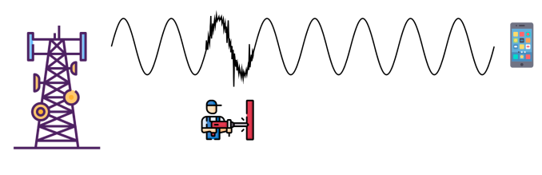

# Trabajo Practico N2

## Nombres

- Nicolas Piñera
- Julian Krede
- Noelia Valarezo

**Nombre del grupo**: Puerto1337

## UNC - Facultad de Ciencias Exactas, Físicas y Naturales

## Cátedra: Comunicaciones de Datos

### Profesores

- Henn, Santiago Martin

- Oliva Cuneo, Facundo

- Solinas, Miguel Ángel

**Fecha:**

---

## Información de los autores

- **Información de contacto**:

  - [nicolas.pinera@mi.unc.edu.ar](mailto:nicolas.pinera@mi.unc.edu.ar)
  - [julian.krede@mi.unc.edu.ar](mailto:julian.krede@mi.unc.edu.ar)
  - [noelia.valarezo@mi.unc.edu.ar](mailto:noelia.valarezo@mi.unc.edu.ar)

---

## Resumen

En este trabajo practico se realiza un repaso de diferentes fenomenos que ocurren en las ondas, como el efecto doppler y la interferencia, viendo las caracteristicas principales de ambos fenomenos y como afectan a las diferentes bandas de transmisión. Ademas se ve una explicacion del protocolo Ethernet aplicado en la capa de enlace de datos del modelo OSI y como fue evolucionando.

**Palabras clave**: Efecto doppler, interferencia, bandas de transmicion, Ethernet, protocolos, WireShark, MAC.

---

## Introducción

El presente informe técnico explora conceptos fundamentales en el campo de las Comunicaciones de Datos. Se analizan fenómenos físicos como el efecto Doppler y la interferencia, detallando cómo afectan a las distintas bandas de transmisión.

A nivel de protocolo, se examina el estándar Ethernet, su evolución y su operación en la capa de enlace de datos. Se explican los componentes de las tramas Ethernet y las propiedades del cable UTP, destacando su diseño para mitigar el ruido.

Finalmente, se presenta un análisis práctico con Wireshark para visualizar los paquetes de red, lo que permite una comprensión tangible de la estructura de las tramas y el uso de las direcciones MAC. El trabajo concluye con una discusión sobre la privacidad digital y los alcances y limitaciones de herramientas como las VPNs.

## Resultados

### Consigna 1

En la imagen se puede apreciar el efecto Doppler, el cual se ve representado en el cambio aparente en la frecuencia de la onda.
El efecto Doppler es el cambio aparente en la frecuencia (o longitud de onda) de una onda cuando existe movimiento relativo entre la fuente emisora y el observador, en este caso entre el barco y el satélite.

Características principales del efecto Doppler:

- La velocidad de propagación de la onda no cambia; lo que varía es la frecuencia y la longitud de onda observadas, la cual puede aumentar o disminuir segun se acerque o se aleje la fuente de ondas.

- Afecta a todo tipo de ondas: sonoras, electromagnéticas, etc.

- La magnitud del efecto depende de la velocidad relativa y de la dirección del movimiento (máximo cuando están en línea recta).

Según la modulación utilizada (ASK, FSK, QPSK, QAM), el efecto Doppler impacta de manera diferente, dependiendo de como se codifica la información:

- ASK: Produce un desplazamiento de frecuencia. Aunque la amplitud nominal no cambia, el receptor suele tener filtros pasabanda centrados en la frecuencia esperada. Si la portadora se desplaza, la señal se atenúa al pasar por el filtro, lo que puede confundir la detección de los niveles de amplitud.
  ASK es muy sensible a Doppler, especialmente en enlaces estrechos y cuerpos con alta velocidad relativa. Incluso unos pocos $kHz$ de desplazamiento pueden causar errores significativos.

- FSK: Al desplazar todas las frecuencias, cambia la diferencia entre “0” y “1”. Si el desplazamiento es comparable a la separación de las frecuencias, el receptor puede confundir un bit con otro.\
  FSK es menos sensible al efecto doppler dado que solo basta con ajustar la separación de las frecuencias que representa los “0” y “1” para mitigar el efecto.

- QPSK: Causa un desplazamiento de frecuencia, que se traduce en rotación de fase progresiva de la señal recibida. Esto puede mover la constelación de símbolos y causar errores de decodificación si la sincronización de fase no se ajusta.\
  QPSK es menos sensible que ASK o FSK; los sistemas modernos incluyen PLL o sincronización adaptativa, permitiendo tolerar velocidades moderadas sin degradación significativa.

- QAM: Afecta tanto fase como frecuencia efectiva, generando desplazamiento en la constelación compleja. Esto puede causar errores de símbolo porque tanto la amplitud como la fase se interpretan mal.\
  QAM presenta mucha sensibilidad en constelaciones densas (16-QAM, 64-QAM), esto sucede porque los símbolos están cerca entre sí. Por lo tanto a mayor densidad, menor tolerancia a Doppler.

No, el efecto Doppler no esta relacionado la razón por la que se desaconseja usar celulares en aviones o sin tener activado el modo avión. Las razones son más bien de interferencia y regulación:\
Los dispositivos electrónicos personales como los celulares pueden emitir señales dentro de la misma banda de frecuencias que los sistemas de comunicación y navegación del avión, produciendo interferencias. Aunque los sistemas modernos están muy protegidos, sigue siendo una precaución.\
Las autoridades que regulan la aviación civil generalmente prohíben transmisiones celulares en vuelo por seguridad y coordinación de frecuencias, incluso si la interferencia real es mínima.

---

### Consigna 2

En la imagen se puede apreciar como el motor de corriente alterna de un taladro electrico provoca interferencia electromagentica o intereferencia por ruido aditivo sobre una señal. Los motores electricos de corriente alterna generan corrientes pulsantes al conmutar o variar el flujo, estas corrientes producen campos electromagnéticos variables alrededor del motor y los cables.

Características principales de la interferencia por ruido aditivo:

- _Amplio espectro:_ Suele afectar una amplia gama de frecuencias (ruido de banda ancha), aunque puede ser también selectivo en frecuencia dependiendo de la fuente.

- _Energía limitada pero superpuesta:_ Aunque la energía de cada componente de ruido es pequeña, se suma a la señal deseada, dificultando su detección o decodificación.

- _Origen eléctrico o electromagnético:_ Puede provenir de motores, equipos electrónicos, descargas atmosféricas, transmisión de radio cercana, etc.

- _Impacto en la relación señal/ruido ($\text{SNR}$):_ Reduce la $\text{SNR}$, lo que aumenta la probabilidad de errores en sistemas digitales o distorsiona señales analógicas.

La vulnerabilidad de las bandas de transmisión a la interferencia electromagnética (IEM) no depende tanto de la banda en sí, sino de una combinación de factores como la frecuencia, la potencia de transmisión, el ancho de banda, la atenuación y, lo más importante, el entorno electromagnético en el que operan.

**Bandas más afectadas por Interferencia:** Estas bandas son propensas porque o bien están muy congestionadas, son utilizadas por dispositivos de baja potencia, o son naturalmente susceptibles a fuentes de ruido omnipresentes.

- _Bandas ISM de 2.4 GHz y 900 MHz:_ Son las bandas más afectadas por la interferencia debido a la congestión. Son bandas de uso libre por lo que una enorme cantidad de dispositivos compiten por el mismo espectro.

- _Bandas de Frecuencias Medias y Bajas:_ Son extremadamente susceptibles al ruido atmosférico (tormentas eléctricas) y al ruido industrial (motores eléctricos, líneas de potencia, sistemas de encendido de vehículos). La propagación por ionosfera también es muy variable e impredecible.

- _Bandas de Uso Libre Sub-GHz:_ Similar a las bandas ISM, son de uso libre y están repletas de dispositivos de bajo consumo como mandos a distancia, sensores de temperatura, abrepuertas de garaje, etc., lo que genera un entorno ruidoso.

**Bandas menos afectadas por Interferencia y Ruido:** Estas bandas son más resistentes porque su propagación es más directa, su uso está estrictamente regulado o operan en frecuencias donde las fuentes naturales de ruido son bajas

- _Bandas de Microondas y Ondas Milimétricas (mmWave):_ Su señal es muy direccional. Es menos probable que se interfieran entre sí a menos que se apunten directamente. La señal es absorbida por la lluvia y el oxígeno.

- _Bandas de Fibra Óptica:_ La luz que viaja por una fibra de vidrio es completamente inmune a la Interferencia Electromagnética (IEM). Es el medio de transmisión más puro y libre de ruido que existe. Cualquier interferencia externa (como un campo magnético) no afecta a la señal de luz dentro del cable.

- _Bandas Celulares Licenciadas:_ Aunque pueden sufrir interferencia, están mucho mejor protegidas que las bandas ISM. Al ser bandas licenciadas, los operadores pagan por el derecho exclusivo de usarlas en un área geográfica específica. Esto permite una planificación celular cuidadosa para minimizar la auto-interferencia dentro de la misma red y protegerlas de interferencias externas de otros servicios.

- _Bandas VHF para Servicios Críticos:_ Son bandas licenciadas y estrictamente reguladas. Cualquier transmisor en estas bandas debe cumplir normas rigurosas y su uso está restringido a aplicaciones vitales, lo que reduce enormemente la cantidad de emisores potenciales que podrían causar interferencia.

El $\text{SNR}$ (Signal-Noise Ratio) Es la relación entre la potencia de la señal útil y la potencia del ruido en un canal de comunicación, se utiliza como medida de la calidad del canal, generalmente se mide en $\text{dB}$ (decibelios)

$$\text{SNR}_{\text{dB}} = 10\cdot\log_{10}{\left( \frac{P_{\text{señal}}}{P_{\text{ruido}}} \right)}$$

El $\text{SNR}$ tiene una relacion directa con el $\text{BER}$, ya que, a mayor de $\text{SNR}$ menor será el $\text{BER}$ y viceversa: a menor $\text{SNR}$ mayor será el $\text{BER}$.

---

### Consigna 3

Ethernet es un estándar de tecnología de red ampliamente utilizado para conectar dispositivos en una red de área local (LAN) o de área metropolitana (WAN) a través de cable. Su nombre proviene del concepto físico de "éter", el medio hipotético por el que se creía que viajaban las ondas electromagnéticas. A diferencia de las redes inalámbricas (como Wi-Fi), Ethernet ofrece una conexión física cableada, lo que la hace más segura, confiable y con mayor velocidad de transferencia de datos. Sus caracteristicas principales son:

- **Tecnología Cableada:** Utiliza principalmente cables de par trenzado, fibra óptica o, en estándares antiguos, cable coaxial.

- **Velocidad y Fiabilidad:** Proporciona conexiones estables y generalmente más rápidas que las redes inalámbricas. Su naturaleza cableada minimiza la interferencia y las pérdidas de conexión.

- **Estándar IEEE 802.3:** Está regulado por el Instituto de Ingenieros Eléctricos y Electrónicos (IEEE) bajo el protocolo 802.3, lo que garantiza la compatibilidad entre equipos de diferentes fabricantes.

- **Direccionamiento MAC:** Cada dispositivo en una red Ethernet tiene una dirección de control de acceso a medios (MAC) única, que se utiliza para identificar el origen y el destino de las tramas de datos.

Mientras los datos bajan por una pila de protocolos y se transmiten se agregan diversa informacion de protocolos en cada capa. La manera que adopta una porcion de datos en cauqier capa se nomina unidad de datos del protoco (PDU). El nombre de las PDU cambia segun la capa. Para la capa de Enlace de datos del modelo OSI, en la cual esta el protocolo de Ethernet, se llaman **trama**. Los campos de la trama Ethernet (IEEE 802.3) son los siguientes:

- **Preámbulo y Delimitador de inicio de trama:** Se utilizan para la sincronización entre los dispositivos emisor y receptor, señalando el inicio de la trama.
- **Dirección MAC de Destino**: Contiene la dirección MAC del dispositivo al que se envía la trama. Si esta en la misma red, sera la direccion MAC del dispositivo de destino, si estan en redes distinas, sera la direccion MAC del router o gateway predeterminado.
- **Dirección MAC de Origen:** Identifica la dirección MAC del dispositivo que envía la trama.
- **Longitud/Tipo:** Indica la longitud del campo de datos o el tipo de protocolo de capa superior (como IPv4 o IPv6) que se transporta en la trama.
- **Datos:** Contiene la información real o "carga útil" que se transmite.
- **Secuencia de Verificación de Trama (FCS):** Es un campo de detección de errores que utiliza un código de redundancia cíclica (CRC) para verificar la integridad de la trama al llegar a su destino.

Diferencias entre Ethernet, Fast Ethernet y Gigabit Ethernet
La principal diferencia entre los protocolos Ethernet, Fast Ethernet y Gigabit Ethernet radica en la velocidad de transmisión de datos, lo cual ha sido la base de la evolución de la tecnología Ethernet a lo largo de las décadas.

- **Ethernet (Estándar Original):**

  - _Velocidad:_ 10 Mbps.
  - _Medio:_ Originalmente utilizaba cable coaxial, pero evolucionó a par trenzado.
  - _Uso:_ Obsoleto en la mayoría de las redes modernas, pero sentó las bases para los estándares posteriores.

- **Fast Ethernet:**

  - _Velocidad:_ 100 Mbps, diez veces más rápido que el estándar original.
  - _Medio:_ Utiliza cable de par trenzado o fibra óptica.
  - _Uso:_ Fue ampliamente adoptado en la década de 1990 y todavía se utiliza en redes donde no se requiere una alta velocidad.

- **Gigabit Ethernet:**
  - _Velocidad:_ 1000 Mbps o 1 Gbps, diez veces más rápido que Fast Ethernet.
  - _Medio:_ Utiliza cable de par trenzado de Categoría 5e o superior y fibra óptica.
  - _Uso:_ Es el estándar actual para la mayoría de las redes LAN en hogares, oficinas y centros de datos debido a su alta velocidad y su capacidad para manejar aplicaciones que demandan mucho ancho de banda.

El cable UTP (Par Trenzado No Apantallado) es el tipo de cable de red más común utilizado en las redes de área local (LAN). Está compuesto por pares de hilos de cobre aislados y entrelazados entre sí. A diferencia de los cables STP (Par Trenzado Apantallado), los cables UTP no tienen un blindaje metálico adicional que proteja los hilos de cobre. Su popularidad se debe a su bajo costo, facilidad de instalación y capacidad para soportar altas velocidades de transmisión de datos.

La construcción de un cable UTP está directamente diseñada para mitigar los efectos de la interferencia electromagnética (IEM) y el ruido aditivo. El trenzado de los hilos de cobre en pares es la clave para lograrlo.

Cuando una señal viaja por un par de hilos trenzados, las dos señales de cada hilo son de polaridad opuesta. Cualquier fuente externa de IEM afectará a ambos hilos del par por igual. Sin embargo, debido a que las señales en los hilos son opuestas, la interferencia se cancela mutuamente en el receptor, ya que el receptor solo lee la diferencia de voltaje entre los dos hilos. Este fenómeno se conoce como **cancelación de ruido por par trenzado.** La frecuencia del trenzado, o sea cuántas veces se trenzan los pares por unidad de longitud, varía según la categoría del cable (Cat 5e, Cat 6, etc.). A mayor frecuencia de trenzado, mayor es la capacidad del cable para resistir la interferencia y la diafonía (el ruido generado por los pares adyacentes dentro del mismo cable), permitiendo velocidades de transmisión más altas.

La diferencia principal entre un cable UTP "derecho" y uno "cruzado" radica en la configuración del cableado interno en los conectores RJ-45 en cada extremo.

- **Cable UTP "Derecho"**:

  - _Configuración:_ Los hilos están en el mismo orden en ambos extremos del cable. El pin 1 de un extremo se conecta al pin 1 del otro, el pin 2 al pin 2, y así sucesivamente.
  - _Uso:_ Se utiliza para conectar dispositivos de diferentes tipos, como un computador a un switch, un router a un switch, o un computador a un hub.

- **Cable UTP "Cruzado"**:
  - _Configuración:_ Los hilos de transmisión de un extremo se conectan a los hilos de recepción del otro, y viceversa. Específicamente, los pares de transmisión del pin 1 y 2 en un extremo se cruzan para conectarse a los pares de recepción del pin 3 y 6 en el otro.
  - _Uso:_ Se utilizaba para conectar dispositivos del mismo tipo directamente, sin un conmutador o concentrador intermedio. Por ejemplo, para conectar un computador a otro computador o un switch a otro switch.

A continuacion se puede ver una captura de pantalla del programa Wireshark en la cual se muestran los paquetes recibidos al momento de realizar el comando $ping <ip>$:

Nos damos cuenta que son los paquetes recibidos ya que en la informacion del mismo dice _Echo (ping) request_ para los paquetes enviados y _Echo (ping) reply_ para los paquetes recibidos. Estos paquetes tienen los siguientes datos hexadecimales:

Los primeros 12 valores en hexadecimal son la MAC de destino (nuestra computadora), los segundos 12 valores representan la MAC de origen. El 0800 representa el tipo, en este caso es IPv4, tambien podemos encontrar informacion de la IPv4 de origen y la IPv4 de destino agregado por la capa de red del modelo OSI.

En este caso la MAC de destino es: 20:9A:7D:AA:E3:D5. La empreza es Sagemcom Broadband Sas.

---

## Discusión y conclusiones

El análisis realizado demuestra que la **dirección MAC constituye un identificador único** a nivel de la capa de enlace de datos que permite la trazabilidad de dispositivos dentro de una red local. Si bien proporciona identificación esencial para la comunicación entre dispositivos en una LAN, también representa un **riesgo potencial para la privacidad**, ya que puede ser utilizada para crear perfiles de dispositivos y patrones de comportamiento en redes accesibles al público.

El **IMEI (International Mobile Equipment Identity)** comparte similitudes fundamentales con la dirección MAC en cuanto a su función como identificador único del fabricante. Sin embargo, presentan diferencias cruciales:

- **Ámbito de operación**: Mientras la MAC opera en redes locales (capa 2 del modelo OSI), el IMEI funciona en redes celulares globales.
- **Alterabilidad**: La dirección MAC puede modificarse mediante software (MAC spoofing), mientras que el IMEI está permanentemente grabado en el hardware del dispositivo móvil
- **Persistencia**: Ambos identificadores permiten el tracking de dispositivos, pero el IMEI ofrece mayor persistencia al ser inalterable

**Una VPN (Red Privada Virtual) no oculta la dirección MAC del dispositivo**. Este hallazgo es fundamental para entender los límites de la protección que ofrece una VPN:

- Operan en la **capa de red (capa 3)**, mientras la MAC funciona en la **capa de enlace (capa 2)**
- El **router local y cualquier dispositivo en la misma red** continúan viendo la dirección MAC real
- Solo proporcionan anonimato a nivel de **dirección IP pública** para comunicaciones externas

Lo que si ofrece una VPN es:

- Encriptación del tráfico de internet
- Ocultamiento de la IP pública real
- Protección contra eavesdropping en redes públicas
- Bypass de restricciones geográficas

La **privacidad digital requiere comprensión de las capas de networking**. Mientras las VPNs proporcionan protección valiosa para el tráfico de internet, no constituyen una solución completa para el anonimato del dispositivo. La **dirección MAC permanece como un identificador vulnerable** en entornos locales, requiriendo medidas adicionales como la randomización de MAC para una protección integral de la privacidad del usuario en todos los niveles de la red.

---

## Referencias

[1] [How and why the Doppler Effect can impact the quality of wireless communications?](https://www.telecomhall.net/t/how-and-why-the-doppler-effect-can-impact-the-quality-of-wireless-communications/23159)

[2] [Wikipedia: Mobile phones on aircraft](https://en.wikipedia.org/wiki/Mobile_phones_on_aircraft)

[3] [Bit Error Rate Analysis of Digital Modulation Techniques
in Wireless Communication System](https://www.irejournals.com/formatedpaper/1703100.pdf)

[4] [Theoretical vs. simulated BER vs. SNR for ASK, FSK, and PSK](https://www.salimwireless.com/2023/08/ber-vs-snr-ask-fsk-psk.html)

[5] [Cable UTP](https://es.wikipedia.org/wiki/Cable_de_par_trenzado)
